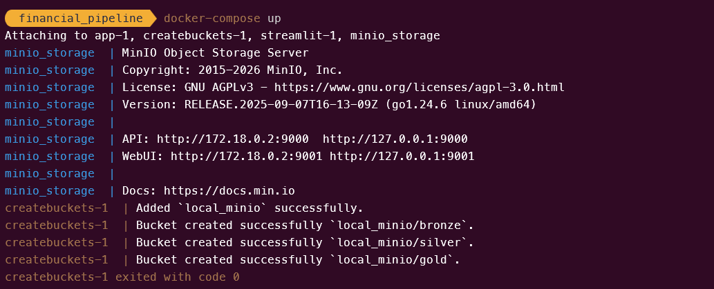

# 🌊 Financial Data lakehouse Engine

A modular, fault-tolerant pipeline aggregating financial data from multiple sources into a structured, analytics-ready lakehouse. Built with a **local-first, cloud-ready** mindset — prototyped on a private ThinkPad T480 cluster with MinIO before cloud deployment.

---

## 📸 Pipeline in Action


---

## 🏗️ Architecture

The system implements the **Medallion Architecture**, enforcing data quality at every layer transition:

```
[CoinGecko]  ──┐
[NBP API]    ──┼──► [Bronze: Raw JSON] ──► [Silver: Typed Parquet] ──► [Gold: DuckDB Views]
[Yahoo Fin.] ──┘     immutable audit        schema-enforced              analytics-ready
```

**Bronze** — raw API responses stored as immutable JSON. Source of truth and full audit trail. Never overwritten.

**Silver** — schema-enforced Parquet files processed with Polars. Data is typed, cast, null-checked, and validated before promotion. Produced by a dedicated `Transformer` per source.

**Gold** — analytical OBT computed in DuckDB via the `Refinery` layer. FX-normalized, ASOF-joined across sources. Config-driven `ViewBuilder` produces analytical views per asset class.

---

## ⚙️ How It Works

Each data source is defined as a **pipe** in `config/pipes.yaml`. On run, `AsyncManager` spins up concurrent async tasks — one per pipe item — bounded by a semaphore to respect API rate limits. Smart Checkpointing skips already-fetched partitions on rerun.

```
pipes.yaml
    │
    ▼
AppConfig (Pydantic validation)
    │
    ▼
AsyncManager
    ├── semaphore(3) — global concurrency cap
    ├── Smart Checkpointing — skip if Silver exists
    ├── aiohttp.ClientSession — shared across all tasks
    └── per pipe:
          Extractor.fetch()       → Bronze (MinIO/S3)
          Transformer.transform() → Silver (MinIO/S3)
                │
                ▼
          ValuationRefinery      → Gold OBT (MinIO/S3)
                │
                ▼
          ViewBuilder            → Gold Views (MinIO/S3)
                │
                ▼
          Streamlit Dashboard    → localhost:8502
```

Adding a new source = two files with decorators. No changes to existing code.

---

## 🛠️ Tech Stack

| Component | Technology | Why |
|-----------|------------|-----|
| Async orchestration | `asyncio` + `aiohttp` | Concurrent API calls without threading overhead |
| Data processing | Polars | Memory-efficient, lazy eval — critical on edge hardware |
| Analytical queries | DuckDB | Embedded OLAP, zero-overhead SQL on Parquet |
| Object storage | MinIO (S3-compatible) | Production-grade local S3 — 100% AWS-compatible |
| Dashboard | Streamlit + Plotly | Interactive views on Gold layer |
| Config & validation | YAML + Pydantic | Type-safe pipeline definitions |
| Containerization | Docker | Consistent env across local cluster and cloud |
| Logging | Python `logging` | Hierarchical module-level loggers, rotating file output |
| Testing | pytest + pytest-mock | Unit tests with mocked boto3 |

---

## 📦 Data Sources

| Source | Coverage | Granularity | Layer |
|--------|----------|-------------|-------|
| CoinGecko `/coins/markets` | 4 categories × 250 coins | Hourly | Bronze → Silver |
| NBP API | Table A — FX rates (last 60 trading days) | Daily | Bronze → Silver |
| Yahoo Finance | 40+ instruments across 6 asset classes | Hourly | Bronze → Silver |

**Yahoo Finance instruments:**

| Class | Tickers |
|---|---|
| Indices | ^GSPC, SPY, BRK-B, ^VIX, DX-Y.NYB |
| Defense | ITA, PPA, XAR, LMT, BA, RTX, NOC, GD, RHM.DE, KTOS |
| Gold & Mining | GC=F, GLD, GDX, GDXJ, NEM, GOLD, PAAS |
| Commodities | USO, DBC, CL=F, XOM, BHP, RIO, VALE, PKN.WA, KGH.WA |
| Semiconductors | NVDA, TSM, ASML, AMD, INTC |
| Uranium & Shipping | CCJ, URA, ZIM, MAERSK-B.CO |

---

## 🚀 Quick Start

Ensure Docker Engine is running:

```bash
cp .env.example .env
# Set MINIO_USER, MINIO_PASSWORD in .env
docker-compose up
```

The `createbuckets` service automatically provisions `bronze`, `silver`, and `gold` buckets on first run.

### docker-compose stack



| Service | Role | Port |
|---------|------|------|
| `minio` | S3-compatible object storage | 9000 (API), 9001 (console) |
| `createbuckets` | One-shot bucket provisioner (runs and exits) | — |
| `app` | Pipeline orchestrator | — |
| `streamlit` | Analytics dashboard | 8502 |

---

## 🗂️ Project Structure

```
financial_pipeline/
├── config/
│   ├── pipes.yaml              # Pipe definitions — sources, params, granularity
│   └── views.yaml              # ViewBuilder definitions — tickers, source, or all
├── dashboard/
│   └── app.py                  # Streamlit dashboard
├── docker/
│   └── Dockerfile
├── docs/
│   └── screenshots/
├── src/
│   ├── async_manager.py        # Async orchestrator — runs all pipes concurrently
│   ├── exceptions/
│   │   ├── extractors.py       # ExtractorError, RateLimitError, AuthError, ServerError
│   │   └── transformers.py     # DataIntegrityError
│   ├── extractors/
│   │   ├── base.py             # BaseExtractor (ABC) — fetch(), retry, rate limit handling
│   │   ├── gecko.py            # CoinGecko markets endpoint
│   │   ├── nbp.py              # NBP exchange rates (Table A/B, historical)
│   │   └── yah_etf.py          # Yahoo Finance chart API
│   ├── transformers/
│   │   ├── base.py             # BaseTransformer — transform(), validate(), run_logic()
│   │   ├── gecko.py            # Gecko → typed Parquet (ticker, price_usd, market_cap, ...)
│   │   ├── nbp_transformer.py  # NBP → typed Parquet (date, code, mid) — multi-day support
│   │   └── yahoo_transformer.py# Yahoo → OHLCV Parquet
│   ├── refinery/
│   │   ├── base_refinery.py    # BaseRefinery — run(), _verify_dependencies(), _save_to_gold()
│   │   ├── valuation_refinery.py # Gold OBT: ASOF JOIN, FX normalization
│   │   └── view_builder.py     # Config-driven analytical views from Gold OBT
│   ├── factories/
│   │   └── pipe_factory.py     # PipeFactory — maps config strings to classes
│   ├── loaders/
│   │   ├── base.py             # BaseLoader (ABC) — save(), load(), exists()
│   │   └── s3_loader.py        # S3Loader — boto3 wrapper for MinIO/S3
│   ├── models/
│   │   └── pipeconfig.py       # PipeConfig, AppConfig (Pydantic)
│   └── utils/
│       ├── logger.py           # Hierarchical rotating logger
│       ├── path_manager.py     # Hive-partitioned path builder
│       └── timer.py            # @contextmanager execution_timer
├── tests/
│   ├── transformers/
│   │   ├── test_base_transformer.py
│   │   └── test_gecko_transformer.py
│   └── loaders/
│       └── test_s3_loader.py
├── main.py
├── docker-compose.yml
└── pyproject.toml
```

---

## 🔌 Adding a New Data Source

1. **Extractor** — create `src/extractors/your_source.py`, extend `BaseExtractor`, implement `get_params()`. Decorate with `@register_extractor("your_key")`.

2. **Transformer** — create `src/transformers/your_transformer.py`, extend `BaseTransformer`, implement `run_logic()` returning a `pl.DataFrame`. Decorate with `@register_transformer("your_key")`.

3. **Config** — add a pipe entry to `config/pipes.yaml`:

```yaml
- id: your_source_id
  extractor_type: your_key
  transformer_type: your_key
  params:
    your_param: value
  granularity: daily  # or hourly
```

No changes to existing code required.

---

## 🗄️ MinIO Storage


Data is stored in Hive-partitioned layout, compatible with Athena, Spark, and DuckDB glob reads:

```
s3://bronze/
└── instrument=gecko_market_scan_stablecoins/
    └── year=2026/month=03/day=15/hour=10/
        └── data_1000.json

s3://silver/
└── instrument=gecko_market_scan_stablecoins/
    └── year=2026/month=03/day=15/hour=10/
        └── data_1000.parquet

s3://gold/
├── report=ValuationRefinery/year=2026/month=03/day=15/
│   └── data_daily.parquet       # OBT — FX-normalized, ASOF-joined
└── views/
    ├── macro_overview/data_daily.parquet
    ├── defense_tracker/data_daily.parquet
    ├── commodities/data_daily.parquet
    ├── semiconductors/data_daily.parquet
    ├── crypto_defi/data_daily.parquet
    └── full_universe/data_daily.parquet
```

---

## ✅ Data Quality

`BaseTransformer.validate()` enforces Silver quality gates before promotion:

- Rejects empty DataFrames
- Rejects datasets where >50% of cells are null
- All failures logged with module-level context

`BaseRefinery._verify_dependencies()` — per-refinery circuit breaker. Verifies Silver partition existence for all pipes before Gold processing. Raises `DataIntegrityError` on missing data. Tolerates ±1h for rate-limited sources (CoinGecko).

---

## 🚧 Roadmap

### ✅ Done
- [x] Modular extractor/transformer architecture with ABC base classes
- [x] Async pipeline execution — `AsyncManager` with per-item semaphore
- [x] Smart Checkpointing — idempotent pipeline runs, skip existing Silver partitions
- [x] Bronze and Silver layers with Hive-partitioned Parquet output
- [x] Hierarchical logging with `RotatingFileHandler`
- [x] Pydantic config validation (`AppConfig` / `PipeConfig`)
- [x] `EXTRACTOR_REGISTRY` + `TRANSFORMER_REGISTRY` — auto-discovery via decorators
- [x] Gold layer — `ValuationRefinery` with DuckDB ASOF JOIN and FX normalization
- [x] `ViewBuilder` — config-driven analytical views from Gold OBT
- [x] 40+ instruments across defense, commodities, semiconductors, crypto, indices
- [x] Streamlit dashboard — price charts, volatility ranking, returns, PLN normalization
- [x] pytest suite — 18 tests, BaseTransformer, GeckoTransformer, S3Loader
- [x] docker image optimization

### 📋 Backlog
- [ ] Historical backfill — replay pipeline for date ranges
- [ ] Reconciliation check in `_verify_dependencies` — `Balance_initial + ΣInflows − ΣOutflows = Balance_final`
- [ ] Per-source semaphore limits (currently global `Semaphore(3)`)
- [ ] `asyncio.wait_for()` per-task timeout
- [ ] Pipeline scheduler — Prefect or GitHub Actions (hourly runs)

### 🚀 Future
- [ ] AWS deployment — S3 + Athena, single `.env` swap from MinIO
- [ ] Terraform IaC for cloud infrastructure
- [ ] ML feature store — volatility signals as model inputs
- [ ] Correlation analysis — defense vs gold vs crypto in crisis periods
- [ ] Anomaly detection — unexpected volume spikes
- [ ] Geopolitical risk tracker — defense, uranium, commodities, crypto as unified narrative

---

## 📚 Requirements

- Docker + Docker Compose
- Python 3.13 (local dev)
- API keys: CoinGecko (free tier), NBP (no key required), Yahoo Finance (no key required)

See `.env.example` for all required environment variables.
