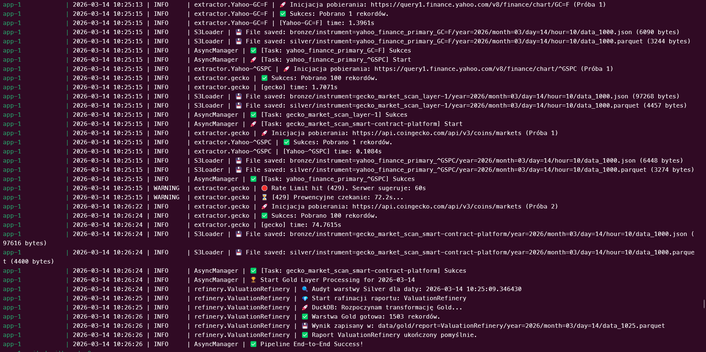
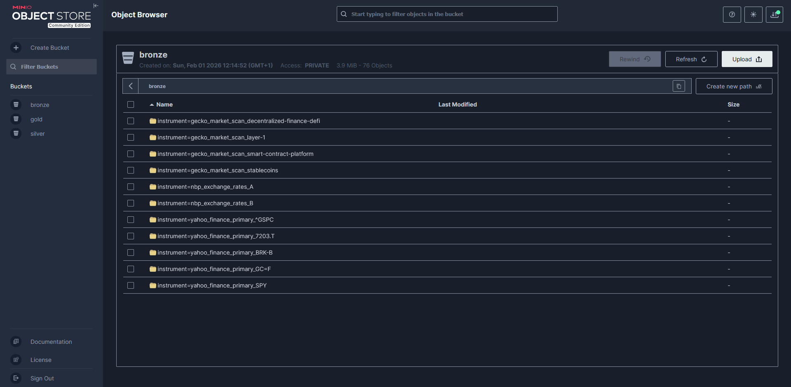

# 🌊 Financial Data Lakehouse Engine

A modular, fault-tolerant pipeline aggregating financial data from multiple sources into a structured, analytics-ready lakehouse. Built with a **local-first, cloud-ready** mindset — prototyped on a private Thinkpad T480 cluster with MinIO before cloud deployment.

---

## 📸 Pipeline in Action


---

## 🏗️ Architecture

The system implements the **Medallion Architecture**, enforcing data quality at every layer transition:

```
[CoinGecko]  ──┐
[NBP API]    ──┼──► [Bronze: Raw JSON] ──► [Silver: Typed Parquet] ──► [Gold: DuckDB Views]
[Yahoo Fin.] ──┘     immutable audit        schema-enforced              analytics-ready
```

**Bronze** — raw API responses stored as immutable JSON. Source of truth and full audit trail. Never overwritten.

**Silver** — schema-enforced Parquet files processed with Polars. Data is typed, cast, null-checked, and validated before promotion. Produced by a dedicated `Transformer` per source.

**Gold** — analytical datasets computed in DuckDB via the `Refinery` layer. Joined instruments, PLN/FX normalization, and aggregated views. *(in progress — `ValuationRefinery`)*

---

## ⚙️ How It Works

Each data source is defined as a **pipe** in `config/pipes.yaml`. On run, `AsyncManager` spins up concurrent async tasks — one per pipe item (e.g. one per crypto category, one per ticker) — bounded by a semaphore to respect API rate limits.

```
pipes.yaml
    │
    ▼
AppConfig (Pydantic validation)
    │
    ▼
AsyncManager
    ├── semaphore(3) — global concurrency cap
    ├── aiohttp.ClientSession — shared across all tasks
    └── per pipe:
          Extractor.fetch()       → Bronze (MinIO/S3)
          Transformer.transform() → Silver (MinIO/S3)
```

Adding a new source = two files with decorators. No changes to existing code.

---

## 🛠️ Tech Stack

| Component | Technology | Why |
|-----------|------------|-----|
| Async orchestration | `asyncio` + `aiohttp` | Concurrent API calls without threading overhead |
| Data processing | Polars | Memory-efficient, lazy eval — critical on edge hardware |
| Analytical queries | DuckDB | Embedded OLAP, zero-overhead SQL on Parquet |
| Object storage | MinIO (S3-compatible) | Production-grade local S3 — 100% AWS-compatible |
| Config & validation | YAML + Pydantic | Type-safe pipeline definitions |
| Containerization | Docker | Consistent env across local cluster and cloud |
| Logging | Python `logging` | Hierarchical module-level loggers, rotating file output |

---

## 📦 Data Sources

| Source | Coverage | Granularity | Layer |
|--------|----------|-------------|-------|
| CoinGecko `/coins/markets` | 4 categories × 250 coins | Hourly | Bronze → Silver |
| NBP API | Tables A & B (FX rates) | Daily | Bronze → Silver |
| Yahoo Finance | SPY, BRK-B, 7203.T, GC=F, ^GSPC | Hourly | Bronze → Silver |

---

## 🚀 Quick Start

Ensure Docker Engine is running:

```bash
cp .env.example .env
# Set MINIO_USER, MINIO_PASSWORD in .env
docker-compose up
```

The `createbuckets` service automatically provisions `bronze` and `silver` buckets on first run.

### docker-compose stack


| Service | Role |
|---------|------|
| `minio` | S3-compatible object storage (port 9000, console 9001) |
| `createbuckets` | One-shot bucket provisioner (runs and exits) |
| `app` | Pipeline orchestrator |

---

## 🗂️ Project Structure

```
financial_pipeline/
├── config/
│   └── pipes.yaml              # Pipe definitions — sources, params, granularity
├── docker/
│   └── Dockerfile
├── src/
│   ├── async_manager.py        # Async orchestrator — runs all pipes concurrently
│   ├── exceptions/
│   │   └── extractors.py       # ExtractorError, RateLimitError, DataIntegrityError, ...
│   ├── extractors/
│   │   ├── base.py             # BaseExtractor (ABC) — fetch(), get_params(), get_headers()
│   │   ├── registry.py         # @register_extractor decorator + EXTRACTOR_REGISTRY
│   │   ├── gecko.py            # CoinGecko markets endpoint
│   │   ├── nbp.py              # NBP exchange rates (Table A/B)
│   │   └── yah_etf.py          # Yahoo Finance chart API
│   ├── transformers/
│   │   ├── base.py             # BaseTransformer — transform(), validate(), run_logic()
│   │   ├── gecko.py            # Gecko → typed Parquet (ticker, price_usd, market_cap, ...)
│   │   ├── nbp_transformer.py  # NBP → typed Parquet (date, code, mid)
│   │   └── yahoo_transformer.py# Yahoo → OHLCV Parquet
│   ├── factories/
│   │   └── pipe_factory.py     # PipeFactory — maps config strings to classes
│   ├── loaders/
│   │   ├── base.py             # BaseLoader (ABC) — save(), load(), exists()
│   │   └── s3_loader.py        # S3Loader — boto3 wrapper for MinIO/S3
│   ├── refinery/
│   │   ├── base_refinery.py    # BaseRefinery — run(), _verify_dependencies(), transform()
│   │   └── valuation_refinery.py # Gold layer: FX-normalized valuation views (in progress)
│   ├── models/
│   │   └── pipeconfig.py       # PipeConfig, AppConfig (Pydantic)
│   └── utils/
│       ├── logger.py           # Hierarchical rotating logger
│       ├── path_manager.py     # Hive-partitioned path builder + Silver existence check
│       └── timer.py            # @contextmanager execution_timer
├── tests/                      # pytest suite (in progress)
├── main.py
├── docker-compose.yml
└── pyproject.toml
```

---

## 🔌 Adding a New Data Source

1. **Extractor** — create `src/extractors/your_source.py`, extend `BaseExtractor`, implement `get_params()`. Decorate with `@register_extractor("your_key")`.

2. **Transformer** — create `src/transformers/your_transformer.py`, extend `BaseTransformer`, implement `run_logic()` returning a `pl.DataFrame`. Decorate with `@register_transformer("your_key")`.

3. **Config** — add a pipe entry to `config/pipes.yaml`:

```yaml
- id: your_source_id
  extractor_type: your_key
  transformer_type: your_key
  params:
    your_param: value
  granularity: daily  # or hourly
```

No changes to existing code required.

---

## 🗄️ MinIO Storage



Data is stored in Hive-partitioned layout, compatible with Athena, Spark, and DuckDB glob reads:

```
s3://bronze/
└── instrument=gecko_market_scan_stablecoins/
    └── year=2024/month=01/day=05/hour=14/
        └── data_1400.json

s3://silver/
└── instrument=gecko_market_scan_stablecoins/
    └── year=2024/month=01/day=05/hour=14/
        └── data_1400.parquet
```

---

## ✅ Data Quality

`BaseTransformer.validate()` enforces Silver quality gates before promotion:

- Rejects empty DataFrames
- Rejects datasets where >50% of cells are null
- All failures logged with module-level context (`transformer.CoinGecko`, etc.)

`BaseRefinery._verify_dependencies()` (Gold layer) — per-refinery circuit breaker. `ValuationRefinery` enforces:

```
Balance_initial + ΣInflows − ΣOutflows = Balance_final  (tolerance: 0.01)
```

Reconciliation failure raises `DataIntegrityError` — no corrupted data reaches Gold.

---

## 🚧 Roadmap

### ✅ Done
- [x] Modular extractor/transformer architecture with ABC base classes
- [x] Async pipeline execution — `AsyncManager` with semaphore concurrency control
- [x] Bronze and Silver layers with Hive-partitioned Parquet output
- [x] MinIO readiness probe with retry logic
- [x] Hierarchical logging with `RotatingFileHandler`
- [x] Pydantic config validation (`AppConfig` / `PipeConfig`)
- [x] `EXTRACTOR_REGISTRY` + `TRANSFORMER_REGISTRY` — auto-discovery via decorators
- [x] Gold layer — `ValuationRefinery` with DuckDB ASOF JOIN and FX normalization
- [x] Smart Checkpointing — idempotent pipeline runs
- [x] `ViewBuilder` — config-driven analytical views from Gold OBT
- [x] 40+ instruments across defense, commodities, semiconductors, crypto, indices

### 🔧 In Progress
- [ ] Streamlit dashboard — consumes `gold/views/`, interactive charts
- [ ] pytest suite — BaseTransformer, GeckoTransformer, S3Loader

### 📋 Backlog
- [ ] Historical backfill — replay pipeline for date ranges
- [ ] Per-source semaphore limits (currently global)
- [ ] `asyncio.wait_for()` per-task timeout
- [ ] Snake_case filename refactor

### 🚀 Future
- [ ] Prefect or GitHub Actions — pipeline scheduler
- [ ] AWS deployment — Lambda + S3 + Athena
- [ ] Terraform IaC
- [ ] ML feature store — volatility signals, correlation matrix

---

## 📚 Requirements

- Docker + Docker Compose
- Python 3.13 (local dev)
- API keys: CoinGecko (free tier), NBP (no key required), Yahoo Finance

See `.env.example` for all required environment variables.